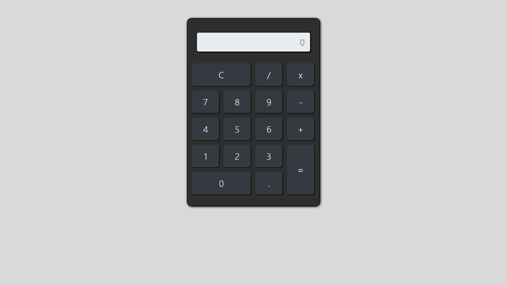

# 🧮 Calculadora 🚀

Bem-vindo! Este README te guia pela nossa calculadora, uma ferramenta simples e poderosa para cálculos rápidos no seu navegador.

## ✨ Demonstração Rápida ⚙️

Imagine ter uma calculadora sempre à mão, sem precisar instalar nada. Basta clicar no botão abaixo e usar:

## 🎯 Funcionalidades Principais ⚙️

*   ➕ **Operações Básicas:**  Soma, subtração, multiplicação e divisão ao seu alcance.
*   🧹 **Limpeza Instantânea:**  O botão "C" apaga tudo, permitindo que você comece de novo rapidamente.
*   🔢 **Decimais Suportados:**  Trabalhe com números com casas decimais sem complicação.
*   📱 **Responsividade:**  A calculadora se adapta ao tamanho da sua tela, seja no computador ou no celular. 

---

## 🕹️ Usando a Calculadora

*   **Clique nos números:** Adicione os números que você deseja calcular.
*   **Escolha a operação:** Clique nos símbolos (+, -, x, /) para definir a operação.
*   **Obtenha o resultado:** Clique em "=" para ver a mágica acontecer!
*   **Limpe a tela:** Se precisar, use o botão "C" para começar um novo cálculo.

## 🧱 Como o Projeto Funciona

*   `index.html`:  A "casa" da calculadora, onde tudo é exibido.
*   `src/estilo.css`:  Deixa a calculadora bonita e organizada, com a ajuda do Bootstrap.
*   `js/index.js`:  A "mente" da calculadora, onde a lógica dos cálculos é feita (você precisa criar e implementar a lógica aqui!).

## 🛠️ Tecnologias 💻

*   **HTML:**  A estrutura básica da página.
*   **CSS:**  Os estilos que dão vida à calculadora.
*   **JavaScript:**  A linguagem que faz a calculadora funcionar.
*   **Bootstrap:**  Um framework para um design responsivo e moderno.
*   **jQuery:** Uma biblioteca para simplificar a manipulação da página.
---

## 💡 Ideias para o Futuro 👩‍💻

*   ➕ Funções avançadas (raiz quadrada, porcentagem).
*   🛡️ Validação de entrada (para evitar erros).
*   🧪 Testes automatizados (para garantir que tudo funcione perfeitamente).
*   📱 Otimização para dispositivos móveis.
*   🎨 Temas personalizados (para deixar a calculadora com a sua cara!).

## 🤝 Contribua!

  "Mostre o quanto você é Inavador!."

    

       👐  Siga os passos para fortalecer este deck:
    

    <ul style="list-style-type: none; padding: 0; margin: 0;">
        <li style="margin-bottom: 10px;">
           1. 🍴 Faça um fork: Adicione este projeto ao seu deck.
        </li>
        <li style="margin-bottom: 10px;">
          2. 🌿 Crie uma branch: Prepare sua mudança(`git checkout -b minha-contribuicao`).
        </li>
        <li style="margin-bottom: 10px;">
          3. ✍️ Prepare seus commits: Guarde suas mudanças (`git commit -am 'Adicione minha contribuição'`).
        </li>
        <li style="margin-bottom: 10px;">
          4. 🚀 Envie suas idéias: Lance sua idéia e/ou sugestão (`git push origin minha-contribuicao`).
        </li>
        <li>
           5. ⚔️ Abra um Pull Request: Desafie este deck original.
        </li>
    </ul>

## 📄 Licença

Este projeto é open source e está licenciado sob a Licença MIT.  Use, modifique e compartilhe!

## 👤 Autor

**Pergunta:** Como posso entrar em contato com o desenvolvedor?

   **Resposta:** Você pode entrar em contato através do perfil do GitHub: 

<a href="https://github.com/Domisnnet">
    
    DomisDev
</a> 

> Feito com ❤️ para facilitar seus cálculos. Encontrou algum problema ou tem alguma sugestão? [Abra uma Issue](https://github.com/seu-usuario/seu-repositorio/issues)! Sua opinião é muito importante para nós!

Gostou da calculadora? ⭐ Dê uma estrela no repositório para nos apoiar!